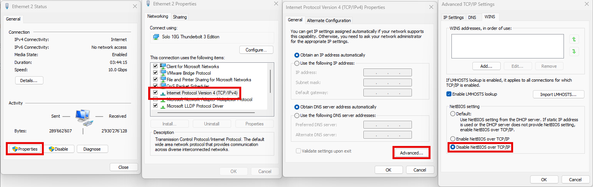

# 🔒 Disable LLMNR and NetBIOS on Windows

By default, Windows ships with insecure legacy protocols like **LLMNR** and **NetBIOS** enabled. These protocols can leak **username and password hashes** over the network and are often abused by tools like [Responder](https://www.a2secure.com/en/blog/how-to-use-responder-to-capture-netntlm-and-grab-a-shell/).  

Disabling them significantly reduces your attack surface.

---

## 🛑 Disable LLMNR (Link-Local Multicast Name Resolution)

### 🔧 Option 1: Using Group Policy (for Windows Pro / Enterprise)

1. Press `Win + R`, type `gpedit.msc` and press Enter  
2. Navigate to:  
   `Computer Configuration > Administrative Templates > Network > DNS Client`  
3. Double-click **Turn Off Multicast Name Resolution**  
4. Set it to **Enabled**  
5. Click **OK**

### 🔧 Option 2: Using the Registry (for Windows Home)

1. Press `Win + R`, type `regedit`, press Enter  
2. Navigate to:

   ```txt
   HKEY_LOCAL_MACHINE\SOFTWARE\Policies\Microsoft\Windows NT\DNSClient
   ```
   If the path doesn't exist, create it.
3. Create a new **DWORD (32-bit) Value**:  
   - **Name**: `EnableMulticast`  
   - **Value**: `0`

---

## 🛑 Disable NetBIOS over TCP/IP

1. Open **Control Panel** → **Network and Sharing Center**  
2. Click on **Change adapter settings**  
3. Right-click your active network interface → **Properties**  
4. Select **Internet Protocol Version 4 (TCP/IPv4)** → **Properties**  
5. Click **Advanced** → Go to the **WINS** tab  
6. Select: **Disable NetBIOS over TCP/IP**  
7. Click **OK** → Apply the settings



---

## 🔄 Reboot

Restart your machine to apply all settings.

---

## ✅ Verification

### LLMNR status via PowerShell:

```powershell
Get-NetAdapterBinding -ComponentID ms_llmnres
```

> The output should show `LLMNR` is **unbound/disabled**.

### NetBIOS status via Command Prompt:

```cmd
nbtstat -n
```

> Should return: **"No names in cache"** or empty output.